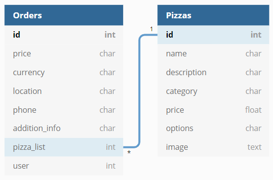

## Pizza Web app

For this task, I'm going to use Django to build the web application. Eventhough I already worked on Laravel and I can fulfill this task on Laravel as well but the only reason I chose Django not Laravel, is that at the moment I'm working for my final year project with BMW group I'm using Django. That is why I prefered to use the mentioned framework.

## Task review

Here is a list of the application functionalities and features to be done:

- [x] Models creation
- [x] User login
- [x] Pizza menu web page
- [x] Adding pizza to cart
- [x] Increasing pizza's quantities in the cart and outside the cart
- [x] Notification bar showing if the pizza is being added/updates
- [x] Checkout page showing the cart items
- [x] Total price in the cart
- [x] Total price in the checkout page including delivery charge and currency selection
- [x] Remove item from the cart
- [x] Clear cart
- [x] Responsive web page ( not fully implemented )
- [x] Admin rights to add/remove pizza
- [x] Checking your order
- [x] Design 
- [x] User order history

To sum up the task:
Any client can access the web application, he can add any pizza to the cart which will be saved in the session then he can checkout and buy the order. This client can as well remove item from the cart, clear the cart, increment/decrement the pizza's quantity in the cart, in the menu and in the checkout page. The price will be instantly updated, in the cart and in the checkout page. In the checkout page the client can choose the payment currency and it will be calculated including the delivery charges. Once the client buys the order, he can still check the session's order.
For a logged in user, he got same features as a guest user but in addition to the above a user can always check his order history since it is saved in the database. 

## Models

Here is a list of the model I'm using in this project, as you can see for the order model there is a user field, which is a foreign key of the User default Django's model. So if the User is logged in then when he places an order a new order will be created with the logged in User's ID.
And for the pizza_list field, we will add the pizza's ids in order to be able to show the user's order history. 

### Cart

At the moment, the cart is being saved over the client's session. Also even if a guest user was adding items to the cart then he realized that he isn't logged in, he still can log in without affecting his cart since it is being saved in the session.

### Order

The order will always be saved in the database and the client's session, but the only difference is that a logged in user who makes an order, his account id will be saved in the order user field else it shows null.

### User 

Django's User system is being used in here, so there isn't any user login/logout/register script. Just few html pages to render the default form of Django. 

## Test-driven Development 

I tried using unit tests for every function in this task but due to the limitation of time I didn't implement and tried all the available and possible cases for each function so maybe I missed some of the special cases. The idea behind using TDD was just to make sure after each function update and changes the system is still working without any error/bug 

## Coding 

For more details about the code and each function check the corresponding file, a docstring for each function is added for some explanations

## Admin 

Added only the ability to create a new pizza object from the web application, in order to edit/remove you need to access the server's database or by using django's rest framework.
If you are an admin and logged you will see a new button in the menu to add a pizza
